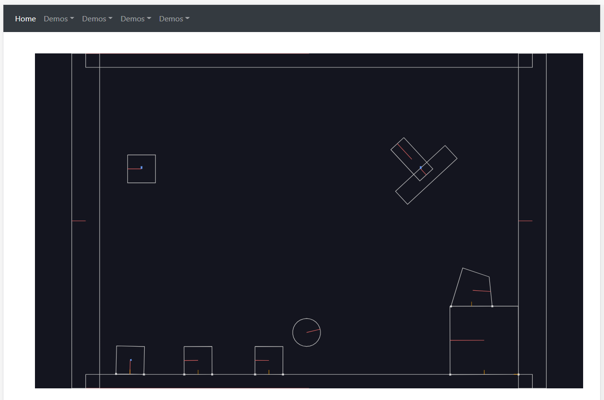

# Working with MatterJS

    ng new App --routing --style scss

    yarn add matter-js --dev

## Add Bootstrap

    yarn add bootstrap jquery popper.js

Edit angular.json

    "styles": [
        "node_modules/bootstrap/dist/css/bootstrap.min.css"
    ],
    "scripts": [
        "node_modules/jquery/dist/jquery.min.js",
        "node_modules/bootstrap/dist/js/bootstrap.min.js",
        "node_modules/popper.js/dist/umd/popper.js"
    ]
